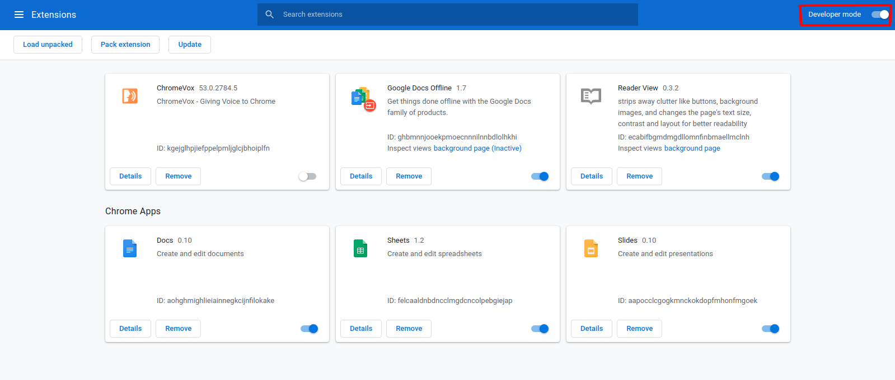

# tabsExport
A chrome extension for exporting your open tabs with a click

## Installation
As this is a chrome extension, you will need [Chrome](https://www.google.com/chrome/) or [Chromium](https://www.chromium.org/Home) browser to use this. For installing the extension locally fo the following steps:

- Clone the repo
    ```
    git clone https://github.com/ashwani99/tabsExport
    ```

- Go to `chrome://extension` using the address bar. It will take you to the extension manager page. Enable developer mode
    

- Click on `Load unpacked` and navigate to the directory where you cloned the project. Once loaded, you will see the extension available

## Usage


## License
[GNU GPL v3.0](LICENSE)